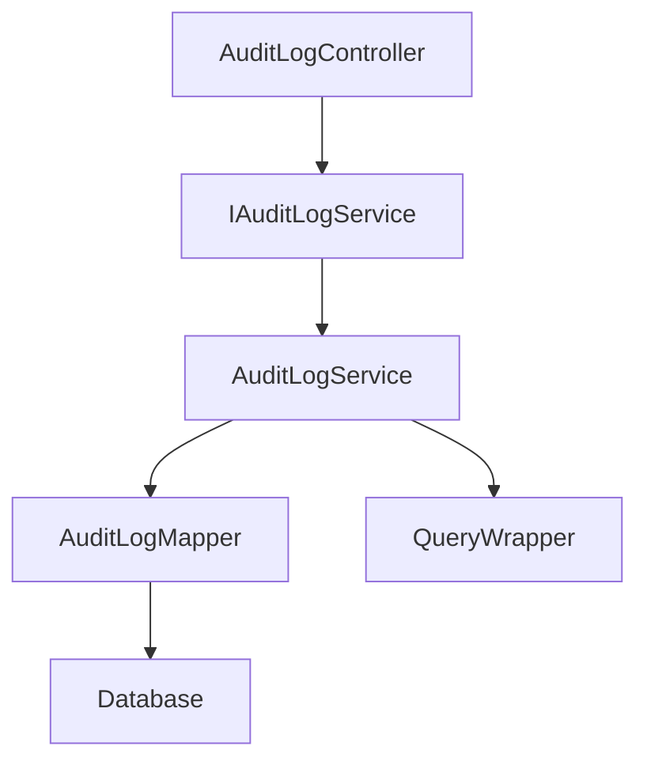
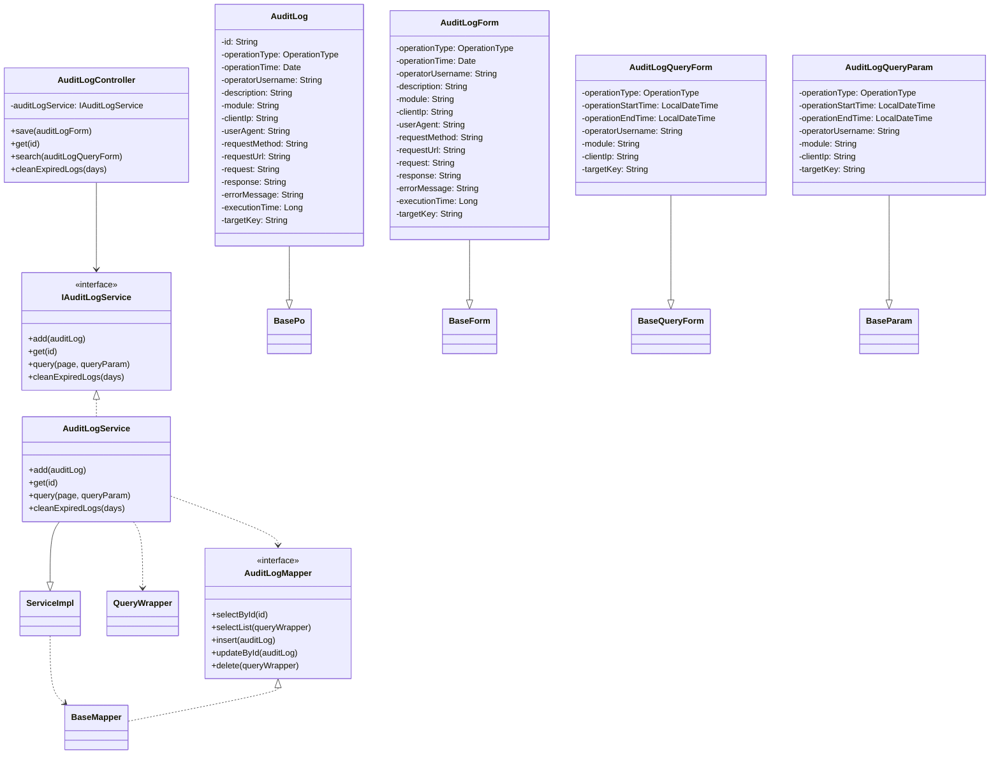
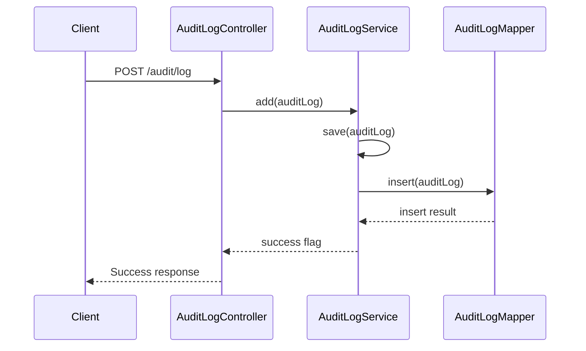
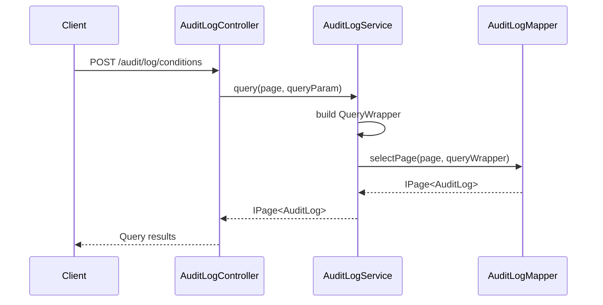
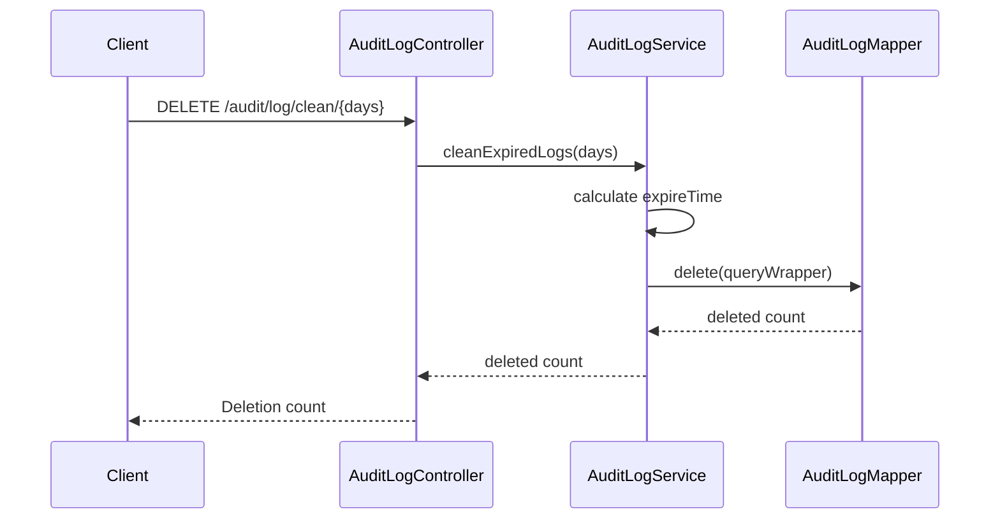

# 审计模块设计文档 (Audit Module Design Documentation)

## 1. 概述 (Overview)

审计模块是一个全面的日志记录和管理系统，用于追踪系统的操作活动、安全事件和用户行为。该模块提供完整的审计日志生命周期管理，包括日志记录、查询、清理等功能。

The audit module is a comprehensive logging and management system for tracking system operations, security events, and user activities. The module provides full lifecycle management of audit logs, including logging, querying, and cleaning functions.

## 2. 架构设计 (Architecture Design)

### 2.1 整体架构图 (Overall Architecture Diagram)



### 2.2 核心组件说明 (Core Components)

#### 2.2.1 控制层 (Controller Layer)
- **AuditLogController**: REST API入口，处理审计日志的增删改查请求

#### 2.2.2 服务层 (Service Layer)
- **IAuditLogService**: 审计日志服务接口
- **AuditLogService**: 审计日志服务实现类，继承自MyBatis-Plus的ServiceImpl

#### 2.2.3 数据访问层 (Data Access Layer)
- **AuditLogMapper**: MyBatis映射接口，负责数据库操作

#### 2.2.4 数据模型层 (Model Layer)
- **AuditLog**: 审计日志核心实体
- **AuditLogForm**: 审计日志表单对象
- **AuditLogQueryForm**: 审计日志查询表单对象
- **AuditLogQueryParam**: 审计日志查询参数对象

## 3. 类图设计 (Class Diagram)



## 4. 时序图 (Sequence Diagrams)

### 4.1 保存审计日志流程 (Save Audit Log Flow)



### 4.2 查询审计日志流程 (Query Audit Log Flow)



### 4.3 清理过期日志流程 (Clean Expired Logs Flow)



## 5. 数据库设计 (Database Design)

### 5.1 表结构 (Table Structure)

审计日志存储在 `base_sys_audit_log` 表中，包含以下字段：

- **id**: 主键
- **operation_type**: 操作类型
- **operation_time**: 操作时间
- **operator_username**: 操作人用户名
- **description**: 操作描述
- **module**: 操作模块
- **client_ip**: 操作IP地址
- **user_agent**: 用户代理
- **request_method**: 请求方法
- **request_url**: 请求URL
- **request**: 请求参数
- **response**: 操作结果
- **error_message**: 错误信息
- **execution_time**: 执行时间(毫秒)
- **target_key**: 操作目标关键key
- **created_time**: 创建时间
- **updated_time**: 更新时间
- **version**: 版本号
- **deleted**: 逻辑删除标志

## 6. 功能特性 (Features)

### 6.1 核心功能 (Core Features)

1. **日志记录**: 支持完整的操作日志记录，包括操作类型、时间、用户、IP等信息
2. **分页查询**: 提供灵活的分页查询功能，支持多种筛选条件
3. **时间范围查询**: 支持按操作时间范围进行查询
4. **日志清理**: 提供清理过期日志的功能，支持按天数保留

### 6.2 查询条件 (Query Conditions)

- 操作类型 (operationType)
- 操作时间范围 (operationStartTime - operationEndTime)
- 操作人用户名 (operatorUsername)
- 操作模块 (module)
- 客户端IP (clientIp)
- 操作目标关键值 (targetKey)

## 7. API 接口 (API Endpoints)

### 7.1 接口列表 (API List)

| 方法 | 路径 | 描述 |
|------|------|------|
| POST | /audit/log | 保存审计日志 |
| GET | /audit/log/{id} | 根据ID获取审计日志 |
| POST | /audit/log/conditions | 条件查询审计日志 |
| DELETE | /audit/log/clean/{days} | 清理过期审计日志 |

### 7.2 请求响应格式 (Request/Response Format)

- **保存审计日志**: 接收 [AuditLogForm](file:///Users/zhoutaoo/WorkSpaces/IdeaProjects/opensabre/base-sysadmin/src/main/java/io/github/opensabre/sysadmin/audit/model/form/AuditLogForm.java)，返回布尔值
- **获取审计日志**: 返回 [AuditLog](file:///Users/zhoutaoo/WorkSpaces/IdeaProjects/opensabre/base-sysadmin/src/main/java/io/github/opensabre/sysadmin/audit/model/po/AuditLog.java) 实体
- **查询审计日志**: 接收 [AuditLogQueryForm](file:///Users/zhoutaoo/WorkSpaces/IdeaProjects/opensabre/base-sysadmin/src/main/java/io/github/opensabre/sysadmin/audit/model/form/AuditLogQueryForm.java)，返回分页结果
- **清理过期日志**: 返回删除记录数

## 8. 性能优化 (Performance Optimization)

### 8.1 数据库优化 (Database Optimization)

- 使用索引优化常用查询字段
- 合理设计分页查询，避免大数据量查询
- 定期清理过期日志，减少数据库负担

### 8.2 缓存策略 (Caching Strategy)

- 当前设计主要依赖数据库查询，可根据需要引入缓存机制

## 9. 错误处理 (Error Handling)

### 9.1 常见错误场景 (Common Error Scenarios)

1. **保存失败**: 记录错误日志并返回false
2. **查询异常**: 通过统一异常处理器处理
3. **参数验证失败**: 通过Bean Validation进行预验证

### 9.2 异常处理策略 (Exception Handling Strategy)

```java
try {
    // 保存审计日志
    return this.save(auditLog);
} catch (Exception e) {
    log.error("保存审计日志失败: {}", auditLog, e);
    return false;
}
```

## 10. 测试策略 (Testing Strategy)

### 10.1 单元测试 (Unit Testing)
- 审计日志实体的验证测试
- 服务层方法的独立测试
- 查询条件构建逻辑测试

### 10.2 集成测试 (Integration Testing)
- 完整的CRUD操作测试
- 分页查询功能测试
- 日志清理功能测试

### 10.3 性能测试 (Performance Testing)
- 大数据量查询性能测试
- 并发场景下的性能表现
- 日志清理操作的效率测试

## 11. 部署考虑 (Deployment Considerations)

### 11.1 环境配置 (Environment Configuration)
- 数据库连接配置
- MyBatis-Plus分页插件配置
- 日志级别配置

### 11.2 监控告警 (Monitoring & Alerting)
- 审计日志记录成功率监控
- 数据库性能监控
- 存储空间使用情况监控

## 12. 维护指南 (Maintenance Guide)

### 12.1 日常维护 (Daily Maintenance)
- 定期清理过期日志
- 监控存储空间使用情况
- 检查查询性能

### 12.2 故障排查 (Troubleshooting)
- 检查数据库连接状态
- 查看相关日志信息
- 验证查询条件正确性

---

*本文档版本: 1.0*
*最后更新: 2026年1月*