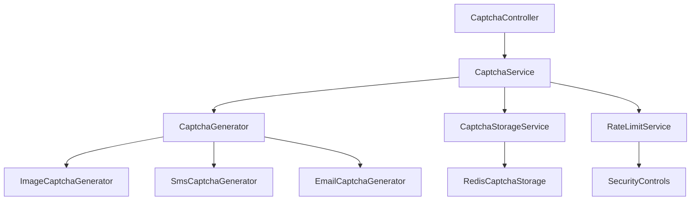
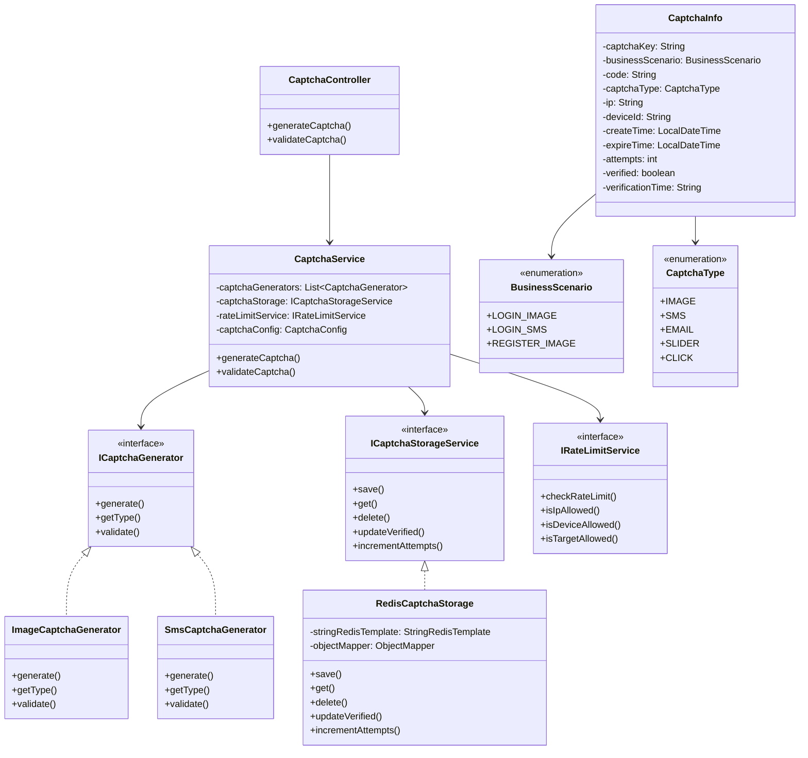
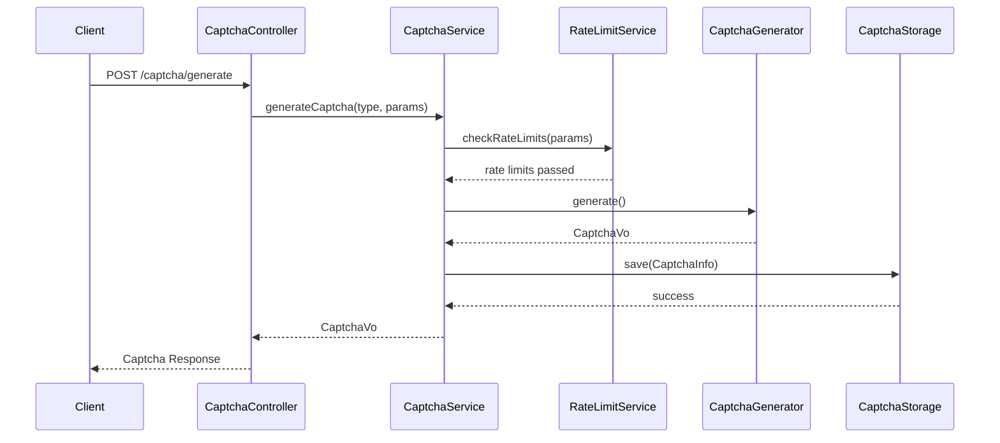
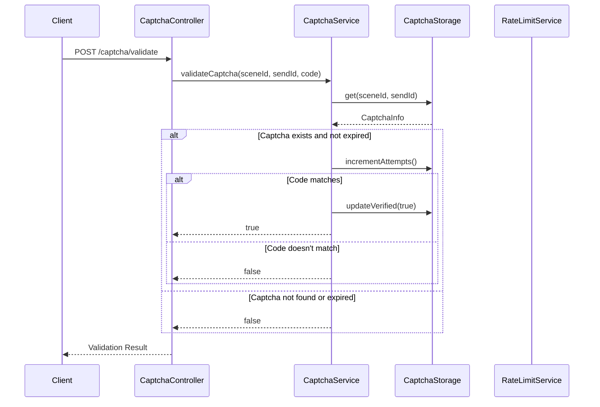
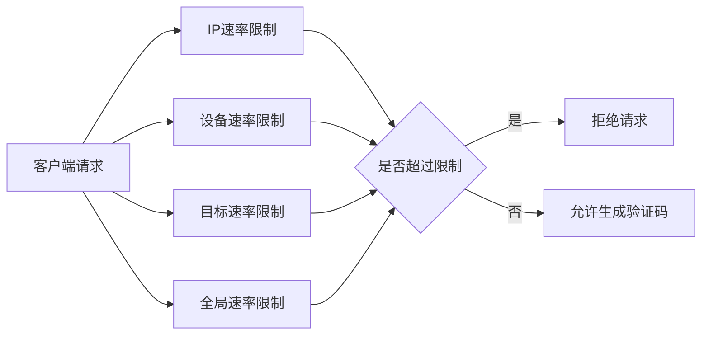

# 验证码模块设计文档 (Captcha Module Design Documentation)

## 1. 概述 (Overview)

验证码模块是一个高度可扩展的安全验证系统，支持多种验证码类型（图片、短信、邮件等），提供完善的速率限制和安全控制机制。采用面向接口编程的设计模式，便于扩展新的验证码类型。

The captcha module is a highly extensible security verification system that supports multiple captcha types (image, SMS, email, etc.) with comprehensive rate limiting and security controls. It follows interface-based programming design patterns for easy extension of new captcha types.

## 2. 架构设计 (Architecture Design)

### 2.1 整体架构图 (Overall Architecture Diagram)



### 2.2 核心组件说明 (Core Components)

#### 2.2.1 控制层 (Controller Layer)
- **CaptchaController**: REST API入口，处理验证码的生成和验证请求

#### 2.2.2 服务层 (Service Layer)
- **CaptchaService**: 核心业务逻辑协调器
- **CaptchaGenerator**: 验证码生成器接口及其实现
- **CaptchaStorageService**: 验证码存储服务接口及其实现
- **RateLimitService**: 速率限制服务

#### 2.2.3 数据模型层 (Model Layer)
- **CaptchaInfo**: 验证码核心实体
- **ClientInfo**: 客户端信息实体
- **BusinessScenario**: 业务场景枚举
- **CaptchaType**: 验证码类型枚举

#### 2.2.4 配置层 (Configuration Layer)
- **CaptchaConfig**: 验证码相关配置

## 3. 类图设计 (Class Diagram)



## 4. 时序图 (Sequence Diagrams)

### 4.1 验证码生成流程 (Captcha Generation Flow)



### 4.2 验证码验证流程 (Captcha Validation Flow)



## 5. 安全设计 (Security Design)

### 5.1 多维度速率限制 (Multi-dimensional Rate Limiting)



### 5.2 安全特性 (Security Features)

1. **时效性控制**: 验证码具有明确的有效期，过期自动失效
2. **一次性使用**: 验证通过后立即标记为已验证状态
3. **尝试次数限制**: 防止暴力破解攻击
4. **多维度限流**: IP、设备、目标、全局四个维度的速率限制
5. **最小间隔控制**: 防止频繁发送验证码
6. **客户端指纹**: 记录IP和设备信息用于安全分析

## 6. 扩展性设计 (Extensibility Design)

### 6.1 新增验证码类型 (Adding New Captcha Types)

```java
// 实现验证码生成器接口
@Component
public class NewCaptchaGenerator implements ICaptchaGenerator {
    @Override
    public CaptchaVo generate(String sceneId, Map<String, Object> params) {
        // 实现具体的验证码生成逻辑
    }
    
    @Override
    public String getType() {
        return CaptchaType.NEW_TYPE.getCode();
    }
    
    @Override
    public boolean validate(String sceneId, String sendId, String code) {
        // 实现验证逻辑
    }
}
```

### 6.2 新增业务场景 (Adding New Business Scenarios)

```java
// 在BusinessScenario枚举中添加新场景
public enum BusinessScenario {
    // ... existing scenarios
    NEW_SCENARIO("NEW_SCENARIO", CaptchaType.NEW_TYPE, "新业务场景描述", 6, 120, 3);
}
```

## 7. 配置管理 (Configuration Management)

### 7.1 主要配置项 (Main Configuration Items)

```yaml
captcha:
  security:
    ip:
      max-attempts: 5           # IP最大尝试次数
      time-window: 3600         # 时间窗口(秒)
    device:
      max-attempts: 5           # 设备最大尝试次数
      time-window: 3600         # 时间窗口(秒)
    target:
      max-attempts: 5           # 目标最大尝试次数
      time-window: 3600         # 时间窗口(秒)
    global:
      max-attempts: 1000        # 全局最大尝试次数
      time-window: 3600         # 时间窗口(秒)
    min-interval: 60            # 最小发送间隔(秒)
    max-attempts: 3             # 验证最大尝试次数
  image:
    code-length: 6              # 图片验证码长度
    expire-time: 300            # 过期时间(秒)
    distortion: true            # 是否启用扭曲
    noise: true                 # 是否启用噪声
  sms:
    code-length: 6              # 短信验证码长度
    expire-time: 300            # 过期时间(秒)
    numeric-only: true          # 是否仅数字
```

## 8. 性能优化 (Performance Optimization)

### 8.1 Redis存储优化 (Redis Storage Optimization)

- 使用TTL自动过期机制
- JSON序列化使用Jackson提高性能
- 合理的键命名空间避免冲突

### 8.2 内存管理 (Memory Management)

- 及时清理过期验证码
- 限制最大存储数量
- 异步处理非关键操作

## 9. 错误处理 (Error Handling)

### 9.1 常见错误场景 (Common Error Scenarios)

1. **速率限制超限**: 返回相应的错误码和提示
2. **验证码不存在**: 提示验证码无效或已过期
3. **验证码已验证**: 防止重复使用
4. **验证码过期**: 自动清理并提示重新获取
5. **验证次数超限**: 锁定并要求重新获取

### 9.2 异常处理策略 (Exception Handling Strategy)

```java
try {
    // 验证码业务逻辑
} catch (RateLimitExceededException e) {
    // 处理速率限制异常
} catch (CaptchaExpiredException e) {
    // 处理验证码过期异常
} catch (ValidationFailedException e) {
    // 处理验证失败异常
}
```

## 10. 测试策略 (Testing Strategy)

### 10.1 单元测试 (Unit Testing)
- 各个服务组件的独立测试
- 验证码生成算法正确性测试
- 速率限制逻辑测试

### 10.2 集成测试 (Integration Testing)
- 完整的验证码生成和验证流程
- Redis存储集成测试
- 多并发场景测试

### 10.3 性能测试 (Performance Testing)
- 高并发场景下的性能表现
- Redis存储压力测试
- 速率限制准确性测试

## 11. 部署考虑 (Deployment Considerations)

### 11.1 环境配置 (Environment Configuration)
- 不同环境的配置文件分离
- Redis连接池配置优化
- 安全参数根据环境调整

### 11.2 监控告警 (Monitoring & Alerting)
- 验证码生成成功率监控
- 速率限制触发情况监控
- 存储使用情况监控

## 12. 维护指南 (Maintenance Guide)

### 12.1 日常维护 (Daily Maintenance)
- 定期清理过期数据
- 监控系统性能指标
- 更新安全配置参数

### 12.2 故障排查 (Troubleshooting)
- 查看相关日志信息
- 检查Redis连接状态
- 验证配置参数正确性

---

*本文档版本: 1.0*
*最后更新: 2024年*