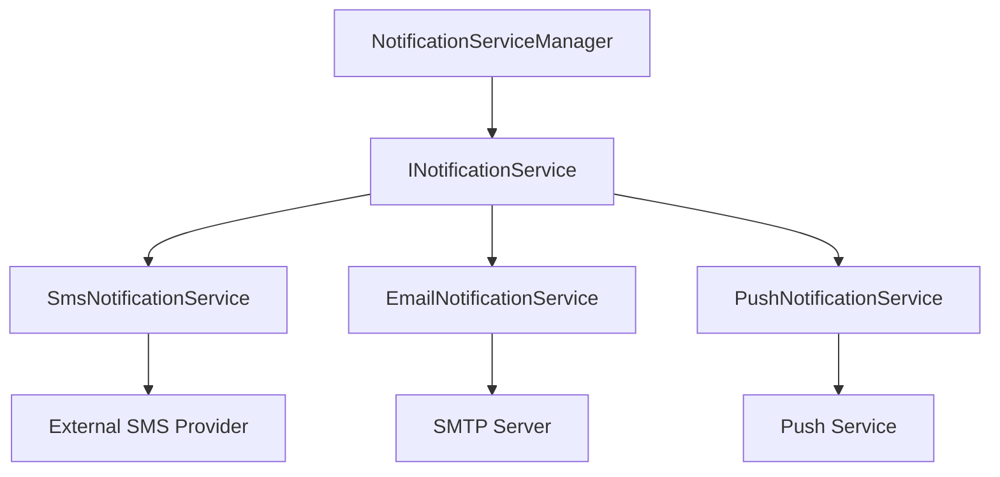
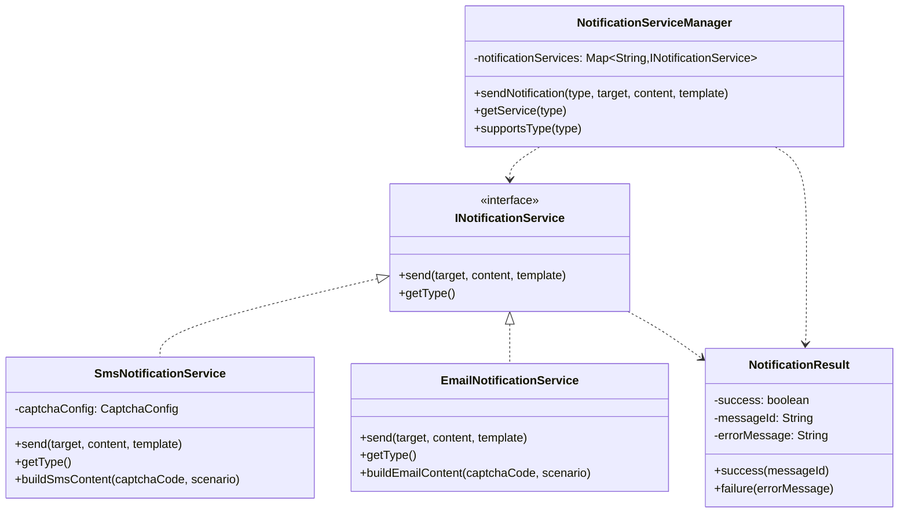
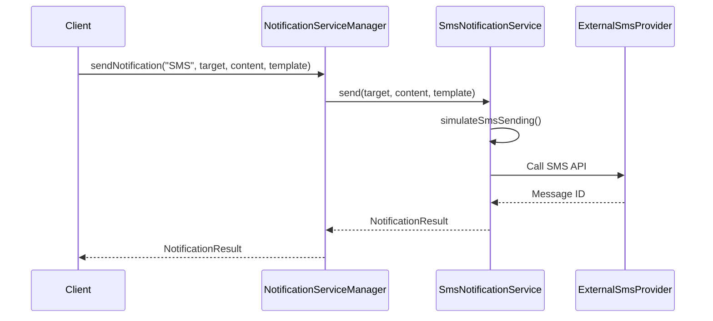
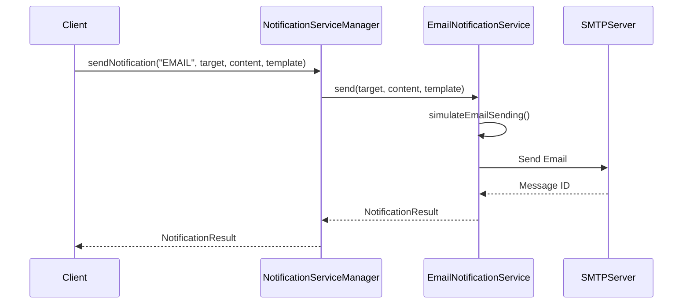

# 通知模块设计文档 (Notification Module Design Documentation)

## 1. 概述 (Overview)

通知模块是一个通用的消息发送系统，支持多种通知方式如短信、邮件、推送等。该模块采用面向接口编程设计，易于扩展新的通知渠道。

The notification module is a universal messaging system supporting various notification methods such as SMS, email, push notifications, etc. The module follows interface-based programming design for easy extension of new notification channels.

## 2. 架构设计 (Architecture Design)

### 2.1 整体架构图 (Overall Architecture Diagram)



### 2.2 核心组件说明 (Core Components)

#### 2.2.1 服务层 (Service Layer)
- **INotificationService**: 通用通知服务接口
- **NotificationServiceManager**: 通知服务管理器，统一管理和调度各种通知服务
- **SmsNotificationService**: 短信通知服务实现
- **EmailNotificationService**: 邮件通知服务实现

#### 2.2.2 数据模型层 (Model Layer)
- **NotificationResult**: 通知发送结果封装类

## 3. 类图设计 (Class Diagram)



## 4. 时序图 (Sequence Diagrams)

### 4.1 发送短信通知流程 (Send SMS Notification Flow)



### 4.2 发送邮件通知流程 (Send Email Notification Flow)



## 5. 扩展性设计 (Extensibility Design)

### 5.1 新增通知渠道 (Adding New Notification Channels)

要添加新的通知渠道，只需实现INotificationService接口：

```java
@Service
public class PushNotificationService implements INotificationService {
    
    @Override
    public NotificationResult send(String target, String content, String template) {
        // 实现推送通知发送逻辑
    }
    
    @Override
    public String getType() {
        return "PUSH";
    }
}
```

### 5.2 配置支持 (Configuration Support)

```yaml
captcha:
  sms:
    provider: alibaba  # 可选值: alibaba, tencent, mock
    template:
      login: "LOGIN_CAPTCHA"
      register: "REGISTER_CAPTCHA"
```

## 6. 功能特性 (Features)

### 6.1 核心功能 (Core Features)

1. **统一接口**: 提供统一的INotificationService接口
2. **多渠道支持**: 支持短信、邮件等多种通知方式
3. **服务管理**: 通过NotificationServiceManager统一管理
4. **结果封装**: 统一的NotificationResult封装发送结果
5. **可配置**: 支持不同短信服务商的配置切换

### 6.2 通知类型 (Notification Types)

- **SMS**: 短信通知
- **EMAIL**: 邮件通知
- **PUSH**: 推送通知 (可扩展)

## 7. API 接口 (API Endpoints)

### 7.1 主要方法 (Main Methods)

- **sendNotification**: 发送通知
- **getService**: 获取特定类型的通知服务
- **supportsType**: 检查是否支持指定类型的通知

## 8. 性能优化 (Performance Optimization)

### 8.1 异步处理 (Asynchronous Processing)

通知发送可采用异步方式处理，提高系统响应速度。

### 8.2 批量发送 (Batch Sending)

支持批量发送通知，提高发送效率。

## 9. 错误处理 (Error Handling)

### 9.1 常见错误场景 (Common Error Scenarios)

1. **服务不可用**: 通知服务暂时不可用
2. **参数错误**: 目标地址或内容格式错误
3. **发送失败**: 通知发送失败

### 9.2 异常处理策略 (Exception Handling Strategy)

```java
try {
    // 发送通知
    return NotificationResult.success(messageId);
} catch (Exception e) {
    return NotificationResult.failure(e.getMessage());
}
```

## 10. 测试策略 (Testing Strategy)

### 10.1 单元测试 (Unit Testing)
- 通知服务的独立测试
- 通知结果封装的验证
- 服务管理器的调度逻辑测试

### 10.2 集成测试 (Integration Testing)
- 完整的通知发送流程
- 不同通知渠道的集成测试

## 11. 部署考虑 (Deployment Considerations)

### 11.1 环境配置 (Environment Configuration)
- 第三方服务的API密钥配置
- 不同环境的服务商选择
- 发送频率限制配置

### 11.2 监控告警 (Monitoring & Alerting)
- 通知发送成功率监控
- 发送延迟监控
- 服务可用性监控

## 12. 维护指南 (Maintenance Guide)

### 12.1 日常维护 (Daily Maintenance)
- 监控通知发送状态
- 检查第三方服务状态
- 管理API配额使用

### 12.2 故障排查 (Troubleshooting)
- 检查日志信息
- 验证配置参数
- 测试第三方服务连通性

---

*本文档版本: 1.0*
*最后更新: 2026年1月*