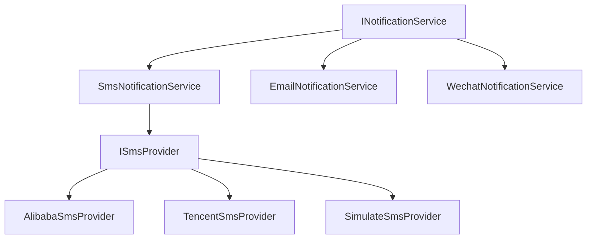
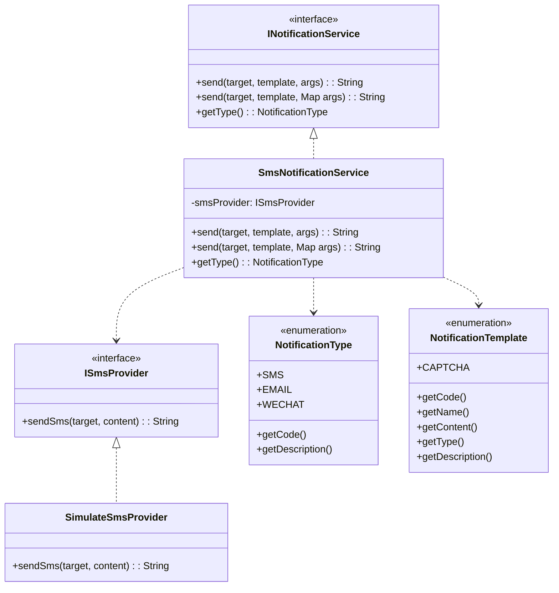
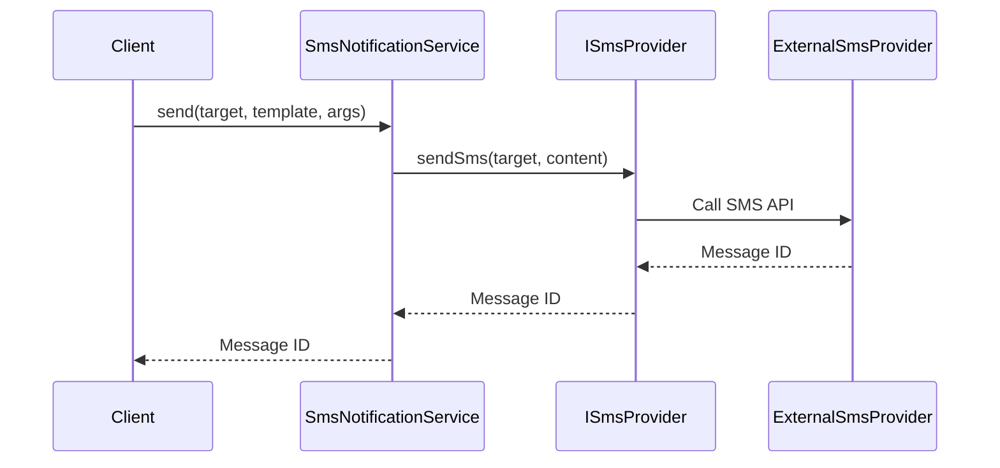

# 通知模块设计文档 (Notification Module Design Documentation)

## 1. 概述 (Overview)

通知模块是一个通用的消息发送系统，支持多种通知方式如短信、邮件、微信等。该模块采用面向接口编程设计，易于扩展新的通知渠道。

The notification module is a universal messaging system supporting various notification methods such as SMS, email, WeChat, etc. The module follows interface-based programming design for easy extension of new notification channels.

## 2. 架构设计 (Architecture Design)

### 2.1 整体架构图 (Overall Architecture Diagram)



### 2.2 核心组件说明 (Core Components)

#### 2.2.1 服务层 (Service Layer)
- **INotificationService**: 通用通知服务接口
- **SmsNotificationService**: 短信通知服务实现
- **EmailNotificationService**: 邮件通知服务实现 (可扩展)
- **WechatNotificationService**: 微信通知服务实现 (可扩展)

#### 2.2.2 提供商层 (Provider Layer)
- **ISmsProvider**: 短信服务提供商接口
- **SimulateSmsProvider**: 模拟短信提供商实现
- **AlibabaSmsProvider**: 阿里云短信提供商 (可扩展)
- **TencentSmsProvider**: 腾讯云短信提供商 (可扩展)

#### 2.2.3 枚举层 (Enum Layer)
- **NotificationType**: 通知类型枚举
- **NotificationTemplate**: 通知模板枚举

## 3. 类图设计 (Class Diagram)



## 4. 时序图 (Sequence Diagrams)

### 4.1 发送短信通知流程 (Send SMS Notification Flow)



## 5. 扩展性设计 (Extensibility Design)

### 5.1 新增通知渠道 (Adding New Notification Channels)

要添加新的通知渠道，只需实现INotificationService接口：

```java
@Service
public class EmailNotificationService implements INotificationService {
    
    @Override
    public String send(String target, NotificationTemplate template, Map<String, String> args) {
        // 实现邮件发送逻辑
    }
    
    @Override
    public String send(String target, NotificationTemplate template, Object... args) {
        // 实现邮件发送逻辑
    }
    
    @Override
    public NotificationType getType() {
        return NotificationType.EMAIL;
    }
}
```

### 5.2 新增短信提供商 (Adding New SMS Provider)

要添加新的短信提供商，只需实现ISmsProvider接口：

```java
@Service
public class AlibabaSmsProvider implements ISmsProvider {
    
    @Override
    public String sendSms(String target, String content) {
        // 实现阿里云短信发送逻辑
    }
}
```

## 6. 功能特性 (Features)

### 6.1 核心功能 (Core Features)

1. **统一接口**: 提供统一的INotificationService接口
2. **多渠道支持**: 支持短信、邮件、微信等多种通知方式
3. **模板管理**: 通过NotificationTemplate枚举管理通知模板
4. **提供商抽象**: 通过ISmsProvider接口抽象短信提供商
5. **参数化内容**: 支持动态模板参数替换

### 6.2 通知类型 (Notification Types)

- **SMS**: 短信通知
- **EMAIL**: 邮件通知
- **WECHAT**: 微信通知

### 6.3 模板类型 (Template Types)

- **CAPTCHA**: 验证码模板

## 7. API 接口 (API Endpoints)

### 7.1 主要方法 (Main Methods)

- **send(String, NotificationTemplate, Map)**: 使用Map参数发送通知
- **send(String, NotificationTemplate, Object...)**: 使用可变参数发送通知
- **getType()**: 获取通知类型

## 8. 性能优化 (Performance Optimization)

### 8.1 异步处理 (Asynchronous Processing)

通知发送可采用异步方式处理，提高系统响应速度。

### 8.2 批量发送 (Batch Sending)

支持批量发送通知，提高发送效率。

## 9. 错误处理 (Error Handling)

### 9.1 常见错误场景 (Common Error Scenarios)

1. **服务不可用**: 通知服务暂时不可用
2. **参数错误**: 目标地址或内容格式错误
3. **发送失败**: 通知发送失败

### 9.2 异常处理策略 (Exception Handling Strategy)

通过提供商接口的实现来处理具体的发送异常。

## 10. 测试策略 (Testing Strategy)

### 10.1 单元测试 (Unit Testing)
- 通知服务的独立测试
- 模板参数替换验证
- 提供商接口的模拟测试

### 10.2 集成测试 (Integration Testing)
- 完整的通知发送流程
- 不同通知渠道的集成测试

## 11. 部署考虑 (Deployment Considerations)

### 11.1 环境配置 (Environment Configuration)
- 第三方服务的API密钥配置
- 不同环境的服务商选择
- 发送频率限制配置

### 11.2 监控告警 (Monitoring & Alerting)
- 通知发送成功率监控
- 发送延迟监控
- 服务可用性监控

## 12. 维护指南 (Maintenance Guide)

### 12.1 日常维护 (Daily Maintenance)
- 监控通知发送状态
- 检查第三方服务状态
- 管理API配额使用

### 12.2 故障排查 (Troubleshooting)
- 检查日志信息
- 验证配置参数
- 测试第三方服务连通性

---

*本文档版本: 2.0*
*最后更新: 2026年1月*